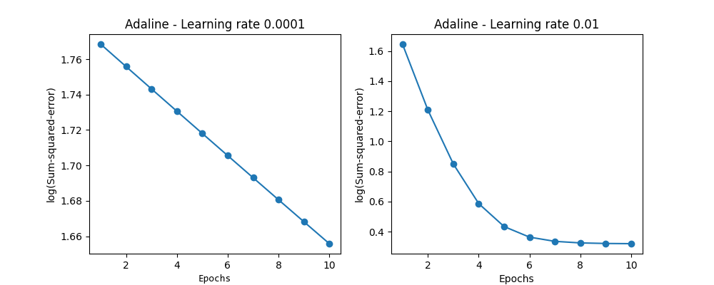
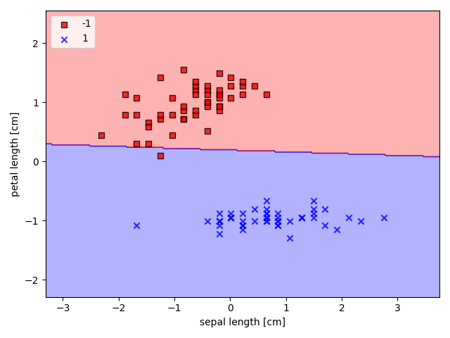
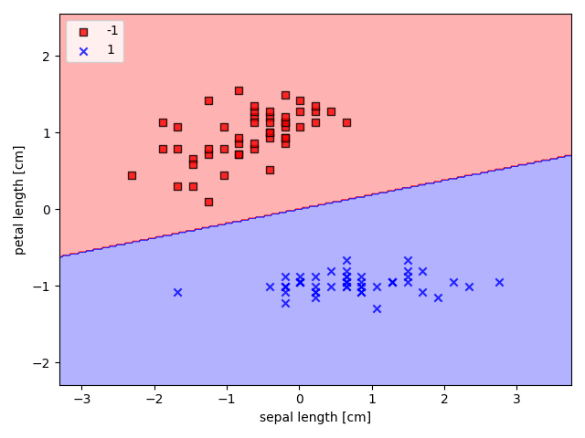
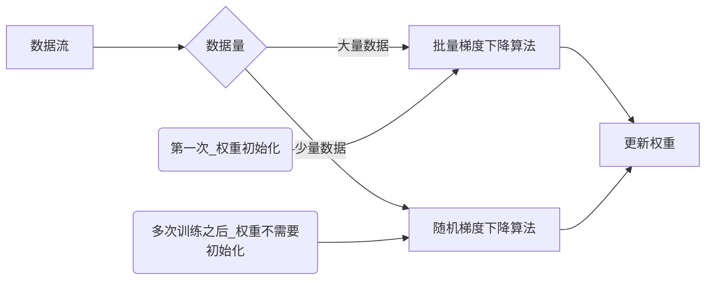

# 学习记录

## matplotlib

[绘制等高线图](https://blog.csdn.net/cymy001/article/details/78513712)

[ListedColormap产生一个颜色映射表](https://codingdict.com/sources/py/matplotlib.colors/11189.html)

[ListedColormap产生一个颜色映射表](https://matplotlib.org/stable/api/_as_gen/matplotlib.colors.ListedColormap.html)

## numpy

np.meshgrid函数，用来网格化数据用的，这样之后，就和matlab上面的meshgird一样了

np.ravel函数，[降维函数,返回引用](https://blog.csdn.net/lanchunhui/article/details/50354978)

[np.uniqe()去重函数](https://blog.csdn.net/u012193416/article/details/79672729)

[Permutation函数](https://blog.csdn.net/qq_35091353/article/details/103094083)

> Permutation()函数的意思的打乱原来数据中元素的顺序。
>  　　１．输入为**整数**，返回一个打乱顺序的**数组**(这个数组的数据是从0到这个整数 - 1之间的数据，只不过进行了乱序)
>  　　２．输入为**数组/list**，返回顺序打乱的**数组/list**
>  与Shuffle()的区别：
>  　　Shuffle()**在原有数据的基础上操作**，打乱元素的顺序，无返回值
>  　　Permutation,**不是在原有数据的基础上操作**，而是返回一个新的打乱顺序的数组

## 感知机的收敛性
感知机的规则就是

$$
z = x*\omega\\
\omega = \omega + \Delta\omega\\
\phi(z) =
\begin{cases}
1, \quad z>0\\
-1,\quad z<=0
\end{cases}
$$


这里通过感知机进行分类，之所以能够成功的原因是原本的数据本身就是线性可分的 ，如果遇到了一个线性不可分的话，那么最终会不停的迭代,不停的更新权重，最终也不会收敛，得到的感知机也不会是一个合格的机器

## 自适应神经元

代价函数(**误差平方和SEE**)：
$$
J(\omega) = \frac12 \sum_i\Big( y^{(i)} -\phi\big( z^{i} \big) \Big)^2
$$
权重：$\omega$, 更新权重：
$$
\omega:=\omega + \Delta \omega
$$
$\Delta\omega$ 权重更新量：
$$
\Delta \omega = -\eta \bigtriangledown J(\omega)
$$
再写的详细清楚一点$\bigtriangledown$的下标$\omega_j$代表的是对$\omega_j$求导，并且$\bigtriangledown_{\omega_j} J = \frac{\partial J}{\partial \omega_j}$
$$
\Delta \omega_j = -\eta \bigtriangledown_{\omega_j} J(w)
$$
其中：$\bigtriangledown J(\omega) = \frac{\partial J}{\partial \omega}$ ，那么$\Delta \omega$的物理意义就显而易见了: $\Delta\omega$就是经过$\eta$的步长之后的$J(\omega)$的反向近似变化量

对$\frac{\partial J}{\partial \omega}$求导之后得：
$$
\begin{align}
\frac{\partial J}{\partial \omega_j} & = -\sum_i\Big( y^{(i)} - \phi\big( z^{(i)} \big) \Big)x_j^{(i)}
\end{align}
$$
这样求导之后的物理意义，就是代价函数对第j个权重进行求导，得到了代价函数在$\omega_j$方向上的变化率（斜率）

如果对所有的方向进行求导的话，就是梯度了


### 训练结果

这里是将数据标准化之后的，批量梯度 下降
$$
x_j = \frac{x_j - \mu_j}{\delta_j}
$$


自适应神经元的SEE和迭代次数的关系



自适应神经元1，学习效率：0.0001



自适应神经元，学习效率：0.01




### 批量梯度下降算法

批量梯度下降算法确实比刚开始的感知机写的代码要更加的少，而且同时操作就是操作整个矩阵（使用矩阵的乘法，同时操控整个矩阵，一次计算出所有的特征的更新值$\Delta \omega$），但是这种算法应该并没有减小时间复杂度，即使我们看不见矩阵乘法背后的一些操作，但是我们不可否认np库的工作人员一定是写了一些算法来计算这些矩阵直接的乘法，那么，即使是库工作人员，他们写的算法，也一定会消耗时间的，我们不能因为有人写好了这一步算法，我们就不管矩阵乘法的时间消耗了。

这种批量剃度下降算法在数据量比较小的时候，还是很好的，但是当数据量大到100W以上呢？这个时候，我们每向全局最小值走一步（迭代一次）那么我们就要对这100W的数据矩阵操作一次，根据矩阵的乘法，我们知道，100W的矩阵和一个标量常数相乘会进行100W次乘法，如果和一个mxn的矩阵相乘的话，会进行$100W \times m n$次乘法，外加若干次加法，那么这个时间消耗是非常恐怖的！

所幸大佬们发明了另一种算法：随机梯度下降算法

### 随机梯度下降算法

看了随机梯度下降算法的代码和讲解之后，发现其实随机梯度下降算法，其实核心就是将感知机和批量梯度下降算法相结合的产物

- 利用了感知机的对每一个训练样本训练之后，就进行权重更新的想法
- 利用了批量梯度下降算法中权重更新函数，$\Delta\omega = \eta \Big( y^{(i)} -  \phi\big( z^{(i)}  \big)\Big)x^{(i)}$

最终得到了随机梯度下降算法，这个算法的好处之一就是可以实时训练，就是来一个数据样本，就对这个样本进行训练（**在原来权重的基础之上**），根据这个好处，随机梯度下降算法可以被用在在线学习之上

那么这个算法的用法就是，每次训练不用再从头开始训练整个数据集了，而是来了一个相关的数据就在原来的基础之上训练一个。




```flow
st=>start: 开始
data=>inputoutput: 流入数据
largeData=>operation: 批量梯度下降算法
smallData=>operation: 随机梯度下降算法
updateW=>operation: 更新权重/训练模型
model=>operation:模型
cond=>condition: 模型是否已经训练？
io=>inputoutput: 输出权重更新量
e1=>end: 结束

st->data(right)->cond
cond(yes)->smallData(right)
cond(no)->largeData(right)
smallData->io(right)
largeData->io(right)
io->updateW
updateW->e1
```

> 总结画flowchart图的坑：
>
> 1. 首先，就是流程图中每个变量的名字和变量的类型，要紧紧的跟在"=>"符号两边，
> 2. 变量中存储的数据（就是流程框中的文字，比如：“开始”，“结束”）和冒号":"之间要加上一个空格
> 3. 除了判断框，否则每个框都只能指出来一个箭头
> 4. end结束框不能指向其他的流程框


